# 计算机基础常识

## 冯·诺依曼及冯·诺依曼体系结构

1944年，`美籍匈牙利数学家 冯·诺依曼` 提出计算机基本结构和工作方式的设想，为计算机的诞生和发展提供了理论基础。时至今日，尽管计算机软硬件技术飞速发展，但计算机本身的体系结构并没有明显的突破，当今的计算机仍属于冯·诺依曼架构。

其理论要点如下：

&#x20;     1、计算机硬件设备由存储器、`运算器`、`控制器`、`输入设备`和`输出设备`5部分组成。

&#x20;     2、`存储程序思想`——把计算过程描述为由许多命令按一定顺序组成的程序，然后把程序和数据一起输入计算机，计算机对已存入的程序和数据处理后，输出结果。

## 图灵及图灵奖

艾伦.麦席森.`图灵`，`英国数学家`，他的图灵机模型为计算机的逻辑工作方式奠定了基础。

图灵机将人们使用纸笔进行数学运算的过程进行抽象，由一个虚拟的机器替代人们进行数学运算。

图灵奖：由`美国计算机协会（ACM）`于1966年设立，专门奖励那些对计算机事业作出重要贡献的个人，它是计算机界最负盛名、最崇高的一个奖项，有“计算机界的诺贝尔奖”之称。

## 戈登·摩尔及摩尔定律

戈登·摩尔，美国科学家，企业家，英特尔公司创始人之一。

摩尔定律：当价格不变时，集成电路上可容纳的元器件的数目，约每隔`18-24个月`便会增加一倍，性能也将提升一倍。

## Ada Lovelace

世界上第一位给计算机写程序的是Ada Lovelace。

## 计算机发展阶段

1946年2月，在美国宾西法尼亚大学世界上第一台电子数字计算机`ENIAC`（Electronic Numerical Integrator And Calculator——电子数值积分和计算机）诞生了，它标志着计算机时代的到来。​

人们根据计算机的性能和使用主要元器件的不同，将计算机的发展大致分为四个阶段。

|     |     年代    |    元件   |
| :-: | :-------: | :-----: |
| 第一代 | 1946－1958 |   电子管   |
| 第二代 | 1959－1964 |   晶体管   |
| 第三代 | 1965－1970 |   集成电路  |
| 第四代 |  1971－至今  | 大规模集成电路 |

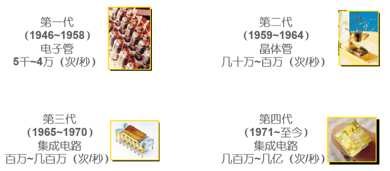

### 第一代计算机

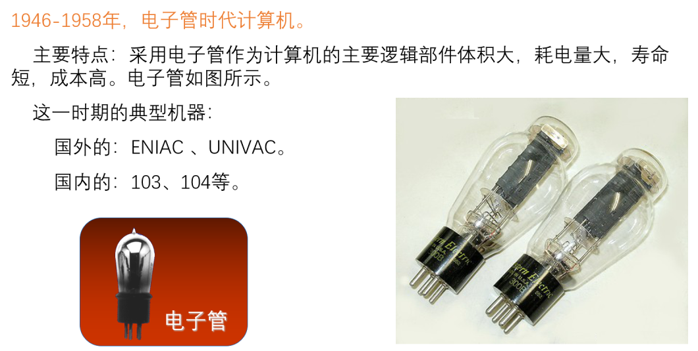

### 第二代计算机

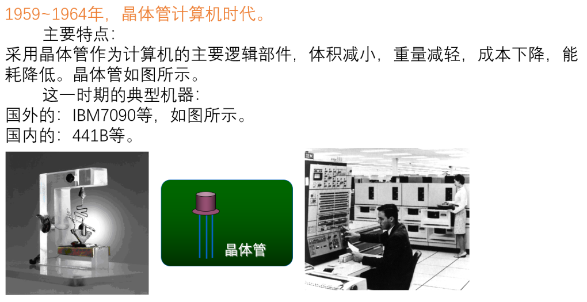

### 第三代计算机

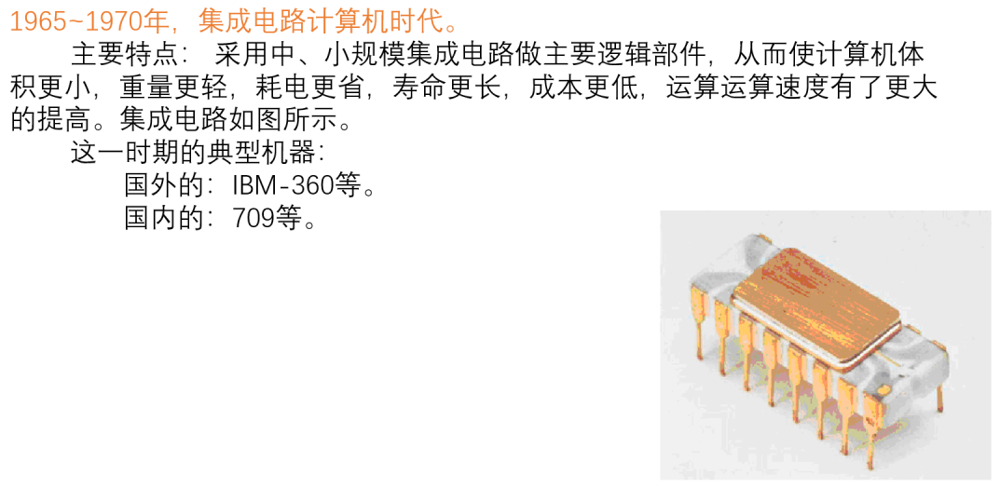

### 第四代计算机

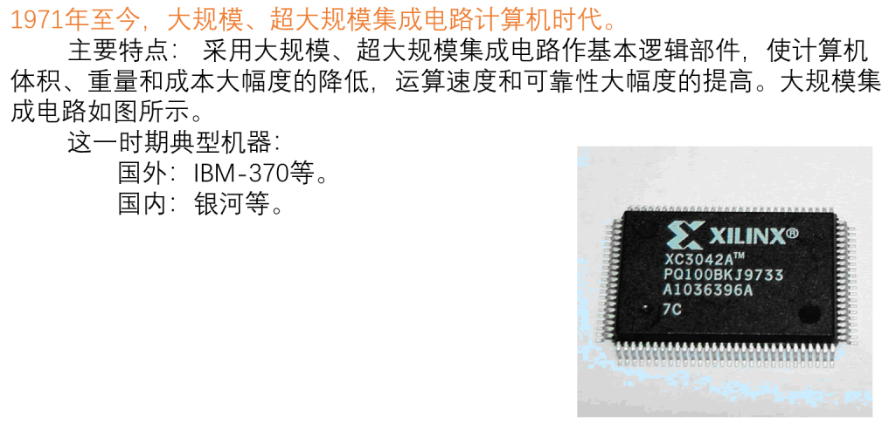

## ENIAC的由来

&#x20;       世界上第一台数字式电子计算机是由美国宾夕法尼亚大学的物理学家约翰·莫克利（John Mauchly）和工程师普雷斯伯·埃克特（J – Presper Eckert）领导研制的取名为ENIAC（Electronic Numerical Integrator And Calculator）的计算机。

&#x20;       1942年在宾夕法尼亚大学任教的莫克利提出了用电子管组成计算机的设想，这一方案得到了美国陆军弹道研究所高尔斯特丹（Goldstine）的关注。当时正值第二次世界大战之际，新武器研制中的弹道问题涉及许多复杂的计算，单靠手工计算已远远满足不了要求，急需自动计算的机器。于是在美国陆军部的资助下，1943年开始了ENIAC的研制，并于1946年完成。当时它的功能确实出类拔萃，例如它可以在一秒钟内进行5000次加法运算，3毫秒便可进行一次乘法运算，与手工计算相比速度要大大加快，60秒钟射程的弹道计算时间由原来的20分钟缩短到30秒。但它也明显存在着缺点。它体积庞大，机器中约有18800只电子管，1500个继电器，70000只电阻及其他各类电气元件，运行时耗电量很大。另外，它的存储容量很小，只能存20个字长为10位的十进位数，而且是用线路连接的方法来编排程序，因此每次解题都要靠人工改接连线，准备时间大大超过实际计算时间。

&#x20;       尽管如此，ENIAC的研制成功还是为以后计算机科学的发展提供了契机，而每克服它的一个缺点，都对计算机的发展带来很大影响，其中影响最大的要算是“程序存储”方式的采用。将程序存储方式的设想确立为体系的是美国数学家冯·诺依曼（Von Neumann)，其思想是：计算机中设置存储器，将符号化的计算步骤存放在存储器中，然后依次取出存储的内容进行译码，并按照译码结果进行计算，从而实现计算机工作的自动化。

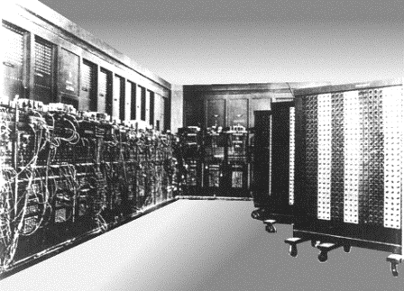

## 计算机的分类

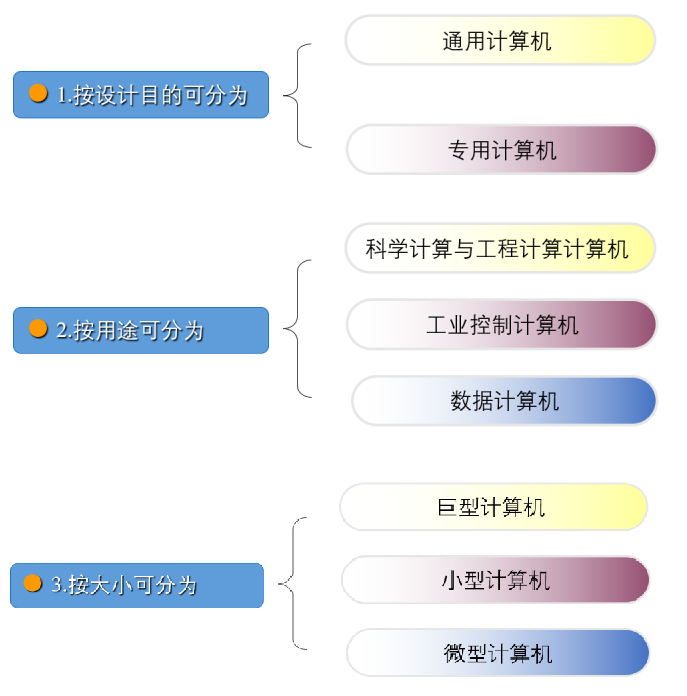

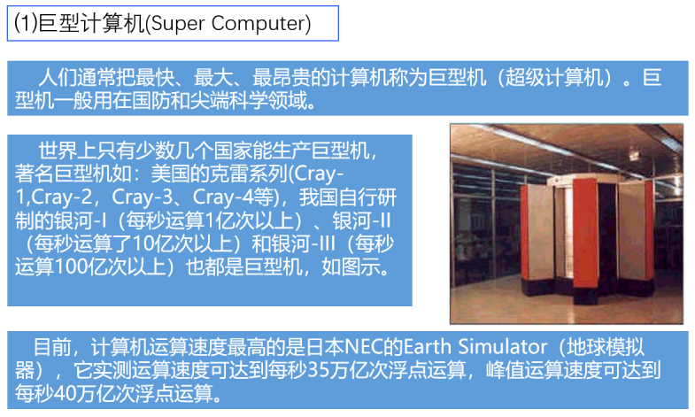

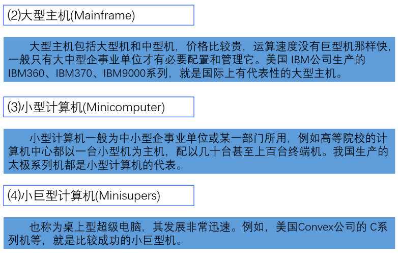

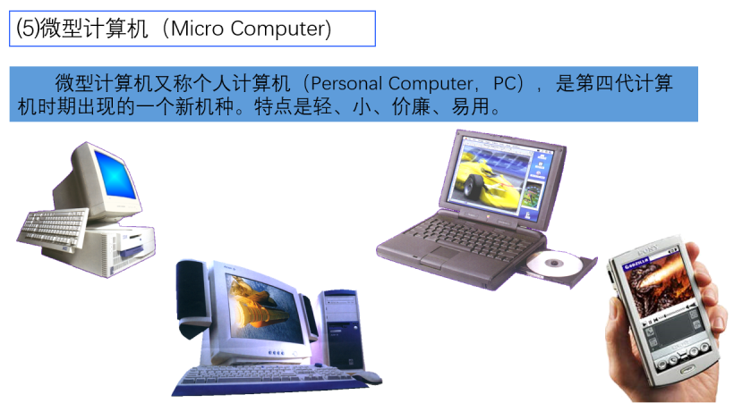

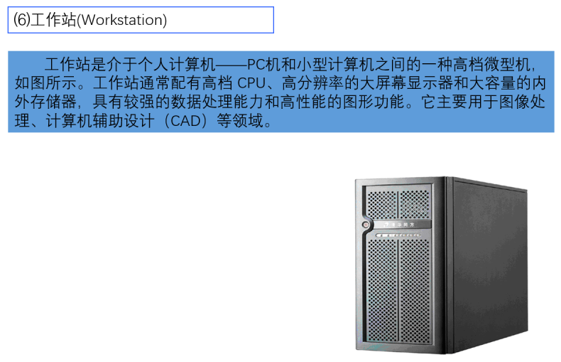

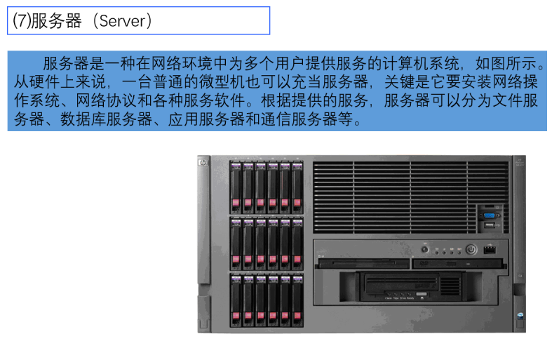

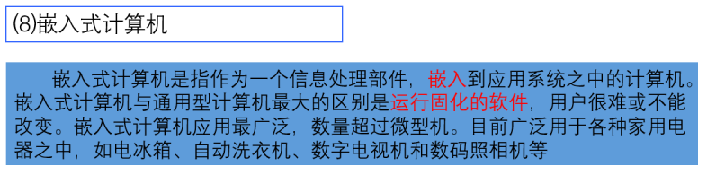

## 计算机的应用

### 科学计算

科学研究和工程技术计算领域是计算机的重要应用领域，也是应用最早、最广泛的领域。计算机的使用，使得很多复杂的科学计算，如军事、航天、气象等学科领域中的许多问题得以解决。人们利用计算机进行各种研究和设计工作，取得比过去用实验方法或粗略估算方法精确得多的结果，从而大大减少研究、试制的时间和人力与费用。科学计算的特点是计算量大和数值变化范围大。

### 数据处理

数据处理又称为信息处理，是用计算机对大量数据进行收集、整理、加工、分析及利用。与科学计算不同，数据处理涉及的数据量大，计算方法却比较简单，大多为逻辑运算，处理结果常以表格形式保存起来。目前，数据处理广泛应用于办公自动化、企业管理、事务管理、情报检索等领域，小到家政管理，大到国家的计划管理，都属于数据处理的范畴。

### 过程控制

利用计算机实时采集、检测数据并进行处理后，按最佳值迅速地对控制对象进行控制，从而大大提高控制的实时性、准确性及各应用领域的自动化程度。

### 计算机辅助系统

计算机辅助系统包括计算机辅助设计CAD（Computer Aided Design）、计算机辅助制造CAM（Computer Aided Manufacturing）、计算机辅助教学CAI（Computer Assisted Instruction）、计算机辅助教育CBE（Computer Based Education）等。计算机辅助设计是设计人员建立某种模式和程序，使计算机按照人的意图进行分析和计算，作出判断和选择，最后输出满意的设计结果或图纸；计算机辅助教学，即多媒体的教学方式，是将有关课程的教学程序存入计算机中，让学生通过计算机进行学习。近年来，多媒体技术和网络技术的发展推动了CBE的发展，网上教学和远程教学已在许多学校展开。

### 人工智能

人工智能AI（Artificial Intelligence）一般是指计算机模拟人脑进行演绎推理和作出决策的思维过程。人们将一些定理和推理规则存入计算机中，然后设计程序让计算机自动寻找解决问题的方法。

### 计算机网络

计算机网络是利用通讯设备和线路将地理位置不同、功能独立的多台计算机互联起来，按照一定的网络通信协议，实现信息交换、资源共享和分布式处理。计算机网络是当前计算机应用的一个重要领域。

### 电子商务

电子商务是指通过计算机和网络进行商务活动，如电子银行、网上交易等。电子商务具有高效率、低支付、高收益和全球性等优点。
