# 计算机系统基本结构

## 计算机系统组成

硬件（Hardware）是指`构成计算机的所有物理部件`，包括各种元器件、电路板卡、机械装置以及各种连接件，是看得见、摸得着的“硬”设备，故称为硬件。

软件（Software）是指管理和控制计算机执行各种操作的所有程序、数据、文档资料的总称。

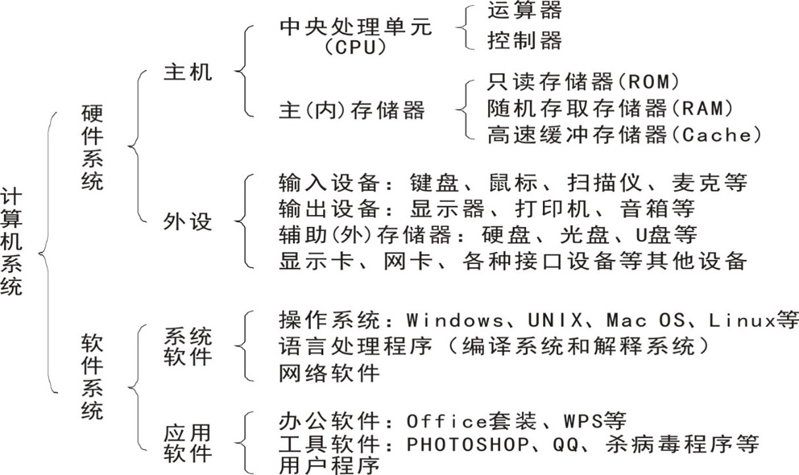

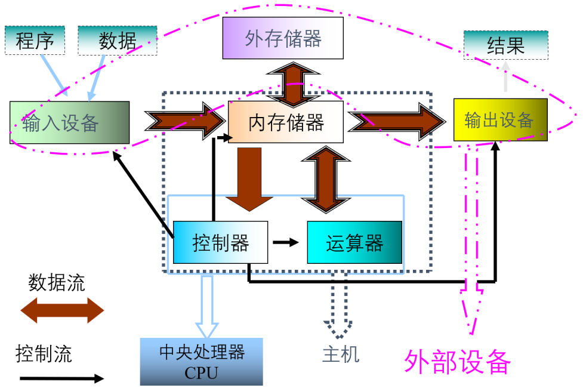

## 计算机硬件

### 中央处理器（CPU）

CPU由`运算器`、`控制器`和一些`寄存器`组成，是计算机系统的核心。

运算器是对数据进行运算和加工，完成算术和逻辑运算的部件；

控制器是计算机的指挥中心，控制各部分协调工作，完成对指令的解释和执行。

lCPU的主要性能指标是`主频`和`字长`。

主频：指计算机主时钟在一秒钟内发出的脉冲数，在很大程度上决定了计算机的运算速度。主频的单位一般是GHz。

比如：Intel Core i5 2300 四核处理器 (2.8GHz/6 MB高速缓存)，“Intel（英特尔）”是CPU的品牌，“Core（酷睿）”代表“产品系列”，“i5 2300”是CPU的型号，“四核处理器”是指CPU内集成了4个处理核心，“2.8GHz”表示CPU的主频，“6 MB高速缓存”代表CPU内置了6MB的高速缓存。

字长：指计算机能够直接处理的二进制数据的位数。单位为位（bit）。计算机的字长直接影响计算机的精度、功能和速度。

平常我们说的32位机，64位机，说的就是32字长，64字长 。

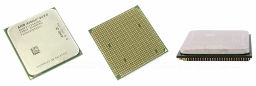

### 存储器

存储器是记忆部件，用于存放程序和数据。

存储器可分为主存储器和辅助存储器两类。

主存储器又称内存或主存，它直接与 CPU交换 信息，是计算机的工作存储器，即当前正在运行的数据 和程序都必须存放在主存内，它的存取速度快但容量较小（当然价格也比较贵）。所谓存储器容量指存储器中所包含的字节数，是标志计算机处理信息能力强弱的一项技术指标。

在计算机内部，信息都是用二进制的形式进行存储、运算、处理和传送的。信息存储单位有位（bit）、字节（Byte简称B）等。

位（bit）：信息的最小单元称为位（bit）。每一个位是二进制中的一个数位，代表两个状态，就是0和1，也就是说计算机其实只认识0和1这两种状态。

字节（Byte）：计算机存储的基本单位。所有的存储器内部结构，都被划分为许许多多的基本单元，每个基本单元的存储量为1个字节（Byte），可以存储8位二进制信息。

Byte作为数据信息的计量单位仍然太小，为了方便计算，引入一些更大的单位，包括KB、MB、GB、TB等。

`1Byte=8bit  1KB=210B=1024B  1MB=1024KB  1GB=1024MB   1TB=1024GB`&#x20;

内存主要由随机存取存储器(RAM)、只读存储器(ROM)和高速缓冲存储器(Cache)构成 。

RAM是一种读写存储器，其内容可以随时根据需要读出，也可以随时重新写放新的信息。当电源关闭时，RAM不能保留数据。比如常见的内存条。

ROM是一种内容只能读出而不能写入和修改的存储器，其存储的信息在制作该存储器时就被写入。当电源关闭时，ROM信息不会丢失。比如BIOS。lCache是指在CPU与内存之间设置的一级或二级高速小容量存储器，称之为高速缓冲存储器。在计算机工作时，系统把将系统由外存读入RAM中，再由RAM读入Cache中，然后CPU直接从Cache中取数据进行操作。

Cache一般直接整合到CPU里。

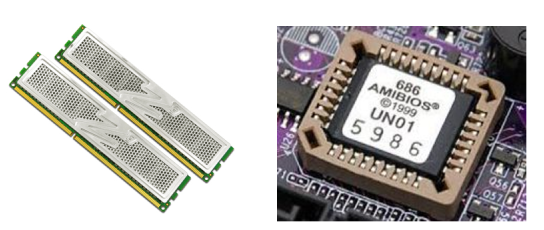

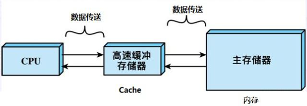

辅助存储器又称为外存储器，用于长期保存数据。由于安装在主机外部，所以属于计算机的外部设备。它的容量一般比较大，而且大部分可以移动，便于在不计算机之间进行信息交流。常见的外存有硬盘、闪存、光盘等等。

硬盘是由若干个硬盘片组成的盘片组，上面覆盖着磁性氧化物。硬盘一般被固定在计算机箱内。

比如：“1TB SATA2.0 7200转 单碟容量：500GB 32MB”硬盘。

“1TB”代表总存储容量，“SATA2.0”代表接口标准，“7200转”代表硬盘每分钟的转速，“单碟容量：500GB”意味着这款硬盘每张碟片的容量是500GB，“32MB”代表缓存容量。

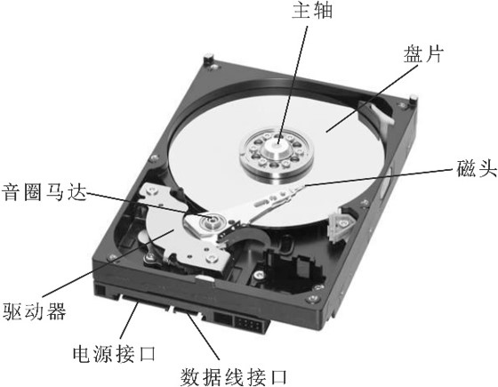

光盘具有容量大、存取速度快、不易受干扰等特点。光盘根据其制造材料和记录信息方式的不同一般分为三类：只读光盘(CD-ROM)、一次性写入光盘(CD-R)和可擦写光盘 (CD-RW)。

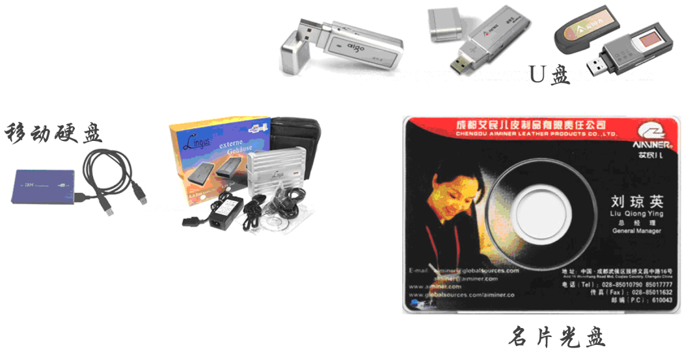

## **输入设备**

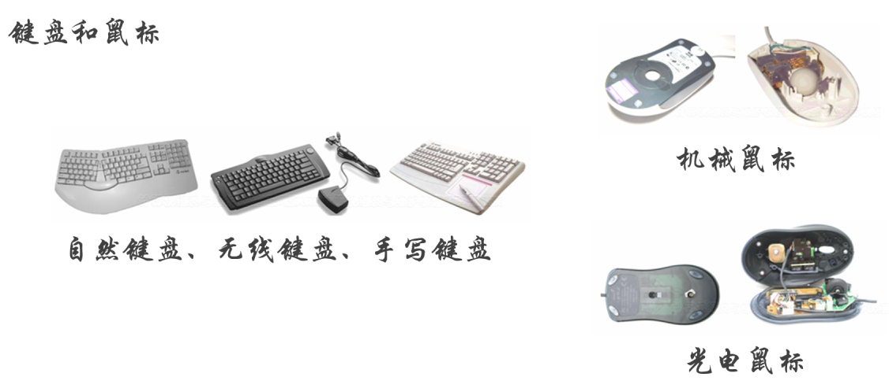

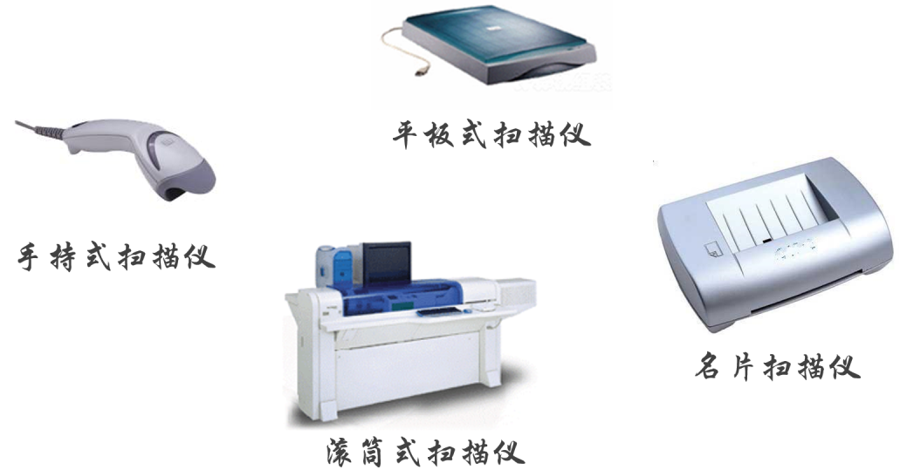

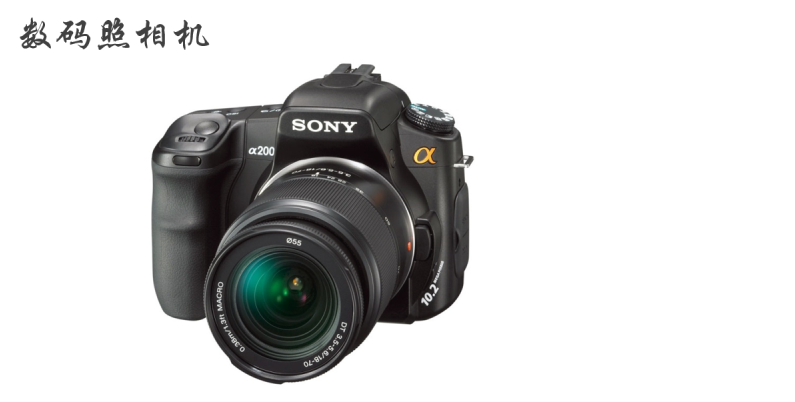

## 输出设备

显示器的性能指标：像素与分辨率

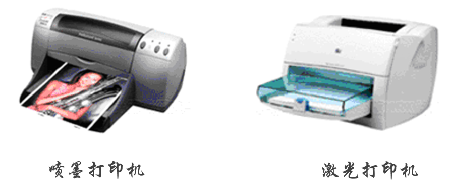

## 总线结构

按照总线上传输信息的不同，总线分为三类，数据总线（DB），地址总线（AB）和控制总线（CB）。

1．数据总线

数据总线用于传递数据信息。数据总线是双向的，CPU既可以向其他部件发送数据，也可以接收来自其他部件的数据。

2．地址总线

地址总线用于传输地址的信息，如要访问外设的内存地址、某个外设的地址等。由于地址通常由CPU提供的，所以地址总线一般是单向传输的。

由于地址总线传输内存的地址，所以，地址总线的位数决定了CPU可以直接寻址的内存范围。例如32位CPU的地址总线通常也是32位，可以表示出232个不同的内存地址，即可访问的内存容量为4GB。

3．控制总线

顾名思义，控制总线用于传送控制信号。例如CPU向内存或输入输出接口电路发出的读写信号；又如，输入输出接口电路向CPU发送的用于同步工作的联络信号等。
