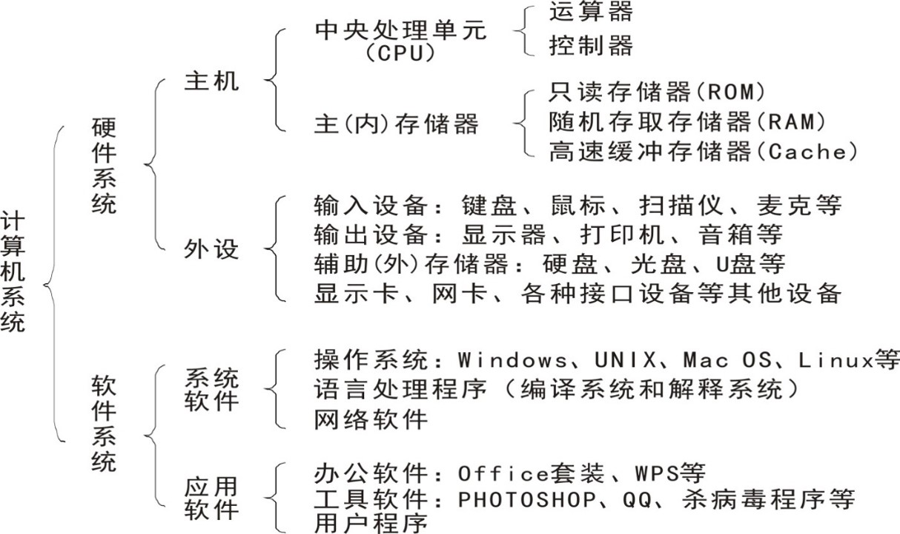
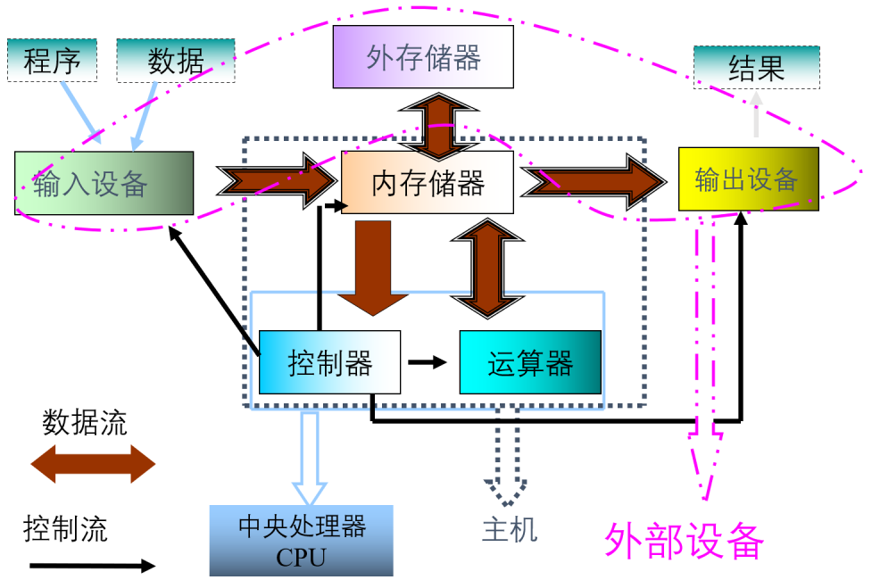
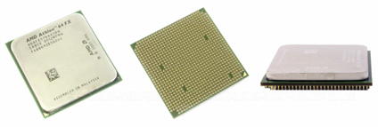
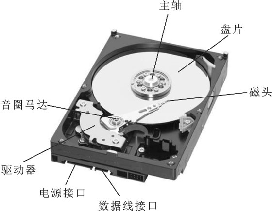
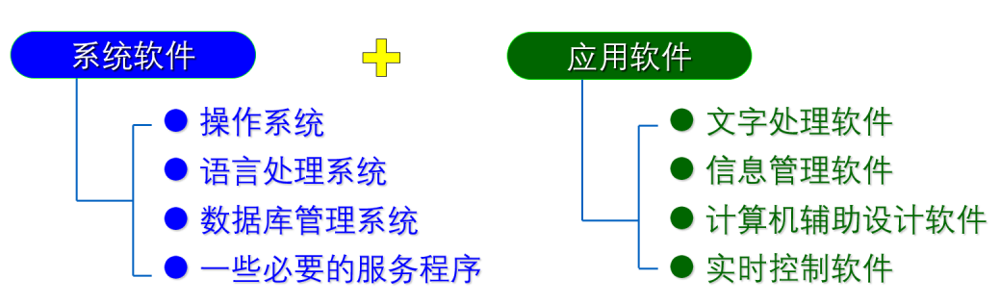

# 计算机系统基本结构

## 计算机系统组成

硬件（Hardware）是指`构成计算机的所有物理部件`，包括各种元器件、电路板卡、机械装置以及各种连接件，是看得见、摸得着的“硬”设备，故称为硬件。

软件（Software）是指管理和控制计算机执行各种操作的所有程序、数据、文档资料的总称。

## 计算机硬件

### 中央处理器（CPU）

CPU由`运算器`、`控制器`和一些`寄存器`组成，是计算机系统的核心。

运算器是对数据进行运算和加工，完成算术和逻辑运算的部件；

控制器是计算机的指挥中心，控制各部分协调工作，完成对指令的解释和执行。

lCPU的主要性能指标是`主频`和`字长`。

主频：指计算机主时钟在一秒钟内发出的脉冲数，在很大程度上决定了计算机的运算速度。主频的单位一般是GHz。

比如：Intel Core i5 2300 四核处理器 (2.8GHz/6 MB高速缓存)，“Intel（英特尔）”是CPU的品牌，“Core（酷睿）”代表“产品系列”，“i5 2300”是CPU的型号，“四核处理器”是指CPU内集成了4个处理核心，“2.8GHz”表示CPU的主频，“6 MB高速缓存”代表CPU内置了6MB的高速缓存。

字长：指计算机能够直接处理的二进制数据的位数。单位为位（bit）。计算机的字长直接影响计算机的精度、功能和速度。

平常我们说的32位机，64位机，说的就是32字长，64字长 。

### 存储器

存储器是记忆部件，用于存放程序和数据。

存储器可分为主存储器和辅助存储器两类。

主存储器又称内存或主存，它直接与 CPU交换 信息，是计算机的工作存储器，即当前正在运行的数据 和程序都必须存放在主存内，它的存取速度快但容量较小（当然价格也比较贵）。所谓存储器容量指存储器中所包含的字节数，是标志计算机处理信息能力强弱的一项技术指标。

在计算机内部，信息都是用二进制的形式进行存储、运算、处理和传送的。信息存储单位有位（bit）、字节（Byte简称B）等。

位（bit）：信息的最小单元称为位（bit）。每一个位是二进制中的一个数位，代表两个状态，就是0和1，也就是说计算机其实只认识0和1这两种状态。

字节（Byte）：计算机存储的基本单位。所有的存储器内部结构，都被划分为许许多多的基本单元，每个基本单元的存储量为1个字节（Byte），可以存储8位二进制信息。

Byte作为数据信息的计量单位仍然太小，为了方便计算，引入一些更大的单位，包括KB、MB、GB、TB等。

`1Byte=8bit 1KB=210B=1024B 1MB=1024KB 1GB=1024MB 1TB=1024GB`

内存主要由随机存取存储器(RAM)、只读存储器(ROM)和高速缓冲存储器(Cache)构成 。

RAM是一种读写存储器，其内容可以随时根据需要读出，也可以随时重新写放新的信息。当电源关闭时，RAM不能保留数据。比如常见的内存条。

ROM是一种内容只能读出而不能写入和修改的存储器，其存储的信息在制作该存储器时就被写入。当电源关闭时，ROM信息不会丢失。比如BIOS。lCache是指在CPU与内存之间设置的一级或二级高速小容量存储器，称之为高速缓冲存储器。在计算机工作时，系统把将系统由外存读入RAM中，再由RAM读入Cache中，然后CPU直接从Cache中取数据进行操作。

Cache一般直接整合到CPU里。

辅助存储器又称为外存储器，用于长期保存数据。由于安装在主机外部，所以属于计算机的外部设备。它的容量一般比较大，而且大部分可以移动，便于在不计算机之间进行信息交流。常见的外存有硬盘、闪存、光盘等等。

硬盘是由若干个硬盘片组成的盘片组，上面覆盖着磁性氧化物。硬盘一般被固定在计算机箱内。

比如：“1TB SATA2.0 7200转 单碟容量：500GB 32MB”硬盘。

“1TB”代表总存储容量，“SATA2.0”代表接口标准，“7200转”代表硬盘每分钟的转速，“单碟容量：500GB”意味着这款硬盘每张碟片的容量是500GB，“32MB”代表缓存容量。

光盘具有容量大、存取速度快、不易受干扰等特点。光盘根据其制造材料和记录信息方式的不同一般分为三类：只读光盘(CD-ROM)、一次性写入光盘(CD-R)和可擦写光盘 (CD-RW)。

## **输入设备**

## 输出设备

显示器的性能指标：像素与分辨率

## 总线结构

按照总线上传输信息的不同，总线分为三类，数据总线（DB），地址总线（AB）和控制总线（CB）。

1．数据总线

数据总线用于传递数据信息。数据总线是双向的，CPU既可以向其他部件发送数据，也可以接收来自其他部件的数据。

2．地址总线

地址总线用于传输地址的信息，如要访问外设的内存地址、某个外设的地址等。由于地址通常由CPU提供的，所以地址总线一般是单向传输的。

由于地址总线传输内存的地址，所以，地址总线的位数决定了CPU可以直接寻址的内存范围。例如32位CPU的地址总线通常也是32位，可以表示出232个不同的内存地址，即可访问的内存容量为4GB。

3．控制总线

顾名思义，控制总线用于传送控制信号。例如CPU向内存或输入输出接口电路发出的读写信号；又如，输入输出接口电路向CPU发送的用于同步工作的联络信号等。

## 计算机软件

计算机软件是控制计算机实现用户需求的计算机操作以及管理计算机自身资源的指令集合， 是指在硬件上运行的程序和相关的数据及文档， 是计算机系统中不可缺少的主要组成部分，可分成两大部分：系统软件和应用软件。

### 系统软件

系统软件是计算机最基本的软件，它负责实现操作者对计算最基本的操作， 管理计算机的软件与硬件资源， 具有通用性， 主要由计算机厂家和软件公司开发提供。 主要包括操作系统、语言处理程序、数据库管理系统和服务程序 。

1.操作系统是控制和管理计算机的软硬件资源、 合理安排计算机的工作流程以及方便

用户的一组软件集合， 是用户和计算机的接口。操作系统主要有windows、UNIX、linux和Mac OS X。

windows操作系统是由微软公司开发，大多数用于我们平时的台式电脑和笔记本电脑。个人电脑常用的系统有windows XP、windows 7和windows 10等等。微软还开发了适合服务器的操作系统，像windows server 2000，windows server 2003。

UNIX基本都是安装在服务器上，没有用户界面，基本上都是命令操作。

linux系统算是UNIX的孩子吧，他继承了UNIX的许多特性，还加入自己的一些新的功能有的linux有界面有的没有。系统有：Red Hat，ubuntu，CentOS，Debian等

Mac OS X是苹果公司开发的操作系统，也是基于UNIX上面开发的。他有着良好的用户体验，华丽的用户界面和简单的操作。

2.语言处理程序： 将用汇编语言和高级语言编写的源程序翻译成机器语言目标程序的程序。

3.数据库管理系统： 是对计算机中所存储的大量数据进行组织、 管理、查询并提供一定处理功能的大型计算机软件。

4.服务程序：为计算机系统提供各种服务性、辅助性的程序。

### 应用软件

应用软件是指除了系统软件以外的所有软件，是为解决实际问题所编写的软件的总称，涉及到计算机应用的各个领域。绝大多数用 户都需要使用应用软件，为自己的工作和生活服务。如字表处理软件 WPSoffice 、Word、Excel 等。

根据上述软硬件资源的关系，人们通常把一台完整的计算机划分成四个结构层次，称为四个平台。它 们从底层到高层分别为硬件平台、系统平台、应用支持平台和应用平台。与用户直接相关、打交道最多的 是应用平台。

### 计算机指令

指令是一组二进制代码，它规定了计算机执行程序的一步操作。

一条指令包含操作码和地址码两个部分，操作码指示计算机怎么操作，必不可少，地址码指定操作对象或操作数据在存贮器中的存放位置，可以没有。

程序：为解决某一问题而设计的一系列指令。

指令系统：计算机能识别并能执行的全部指令的集合。

