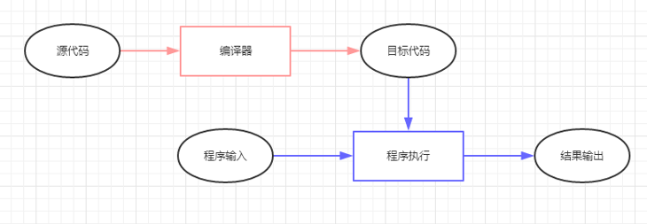
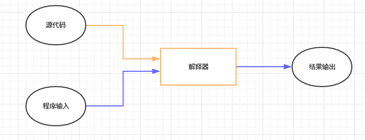

# 计算机语言

程序就是一系列的操作步骤，计算机程序就是由人事先规定的计算机完成某项工作操作步骤。每一步骤的具体内容由计算机能够理解的指令来描述，这些指令告诉计算机“做什么”和“怎么做”。编写计算机程序所使用的语言称为程序设计语言。

通常分为三类：机器语言、汇编语言和高级语言。

## 机器语言

计算机最早的语言处理程序是机器语言，它是计算机直接识别的语言，速度快。

机器语言是用二进制代码编写计算机程序的，因为又称二进制语言，属于低级语言。

例如用机器语言来表示“8+4”这个算式，是一串二进制码“00001000 00000100 00000100”。

机器语言是其它计算机语言的基础，因为计算机硬件只能识别0\1的二进制，无论后面的计算机语言如何发展，最终在计算机内能够执行的只能是0\1的二进制编码，故而后面所有的计算机语言都需要一个翻译的东西，将其翻译为二进制的编码执行，这个起着翻译官作用的就是编译器或解释器。

机器语言优点是最底层，速度最快，缺点是最复杂，开发效率最低。

### 汇编语言

汇编语言用助记符代替了操作码，用地址符号或标号代替地址码。这样就用符号代替了机器语言的二进制码。汇编语言也称为符号语言。比起机器语言，汇编大大进步了。尽管还是复杂，用起来容易出错，但在计算机语言发展史上是机器语言向更高级的语言进化的桥梁。

比如：MOV AL，20H；//将8位数据20H传送到AL寄存器，就是赋值语句。

用汇编语言编写的源程序不能被计算机直接识别，必须使用某种特殊软件将用汇编写的源程序翻译和连接成能被计算机直接识别的二进制代码。

汇编语言优点是比较底层，速度最快，缺点是复杂，开发效率最低。

## 高级语言

高级语言是一种接近于人们使用习惯的程序设计语言。

高级语言所编写的程序不能直接被计算机识别，必须经过转换才能被执行，按转换方式可分为2类：

#### 编译类

事先编好一个叫做编译程序的机器语言程序放在计算机中，当高级语言编的源程序输入计算机时，编译程序就把整个源程序自动翻译成用机器指令表示的目标程序。使用比较方便、效率较高，但源程序一旦需要修改，必须先修改再重新编译整个源程序才执行，跨平台性较差，如C、C++、Delphi、Pascal、Fortran等。

#### 解释类

事先编好一个叫做解释程序的机器语言程序放在计算机中，当高级语言源程序输入计算机后，解释程序自动地逐句翻译源程序，译一句执行一句。

使用效率比较低，依赖解释器，跨平台性好，如Python，Php，ASP，Ruby，Java等。

编译的结果是另外一种语言，而解释的就是一种中间语言。

计算机高级语言的发展分为两个阶段，以 1980 年为分界线，前一阶段属于结构化语言或者称为面向过程的语言(C、fortran)，后一阶段属于面向对象的语言（C++、java）。

面向对象语言的发展有两个方向：一种是纯面向对象语言，如Smalltalk、EIFFEL等；另一种是混合型面向对象语言，即在过程式语言中加入类、继承等成分，如C++、Objective-C等。
