# 数制转换

## 什么是数制？

所谓数制，就是人们利用符号来计数的科学方法，又称为计数制。

数制有很多种，例如最常使用的十进制，钟表的六十进制（每分钟60秒、每小时60分钟），年月的十二进制（一年12个月）等。

无论哪种数制，都包含两个基本要素：`基数`和`位权`。

基数：在一个计数制中，表示每个数位上可用字符的个数称为该计数制的基数。

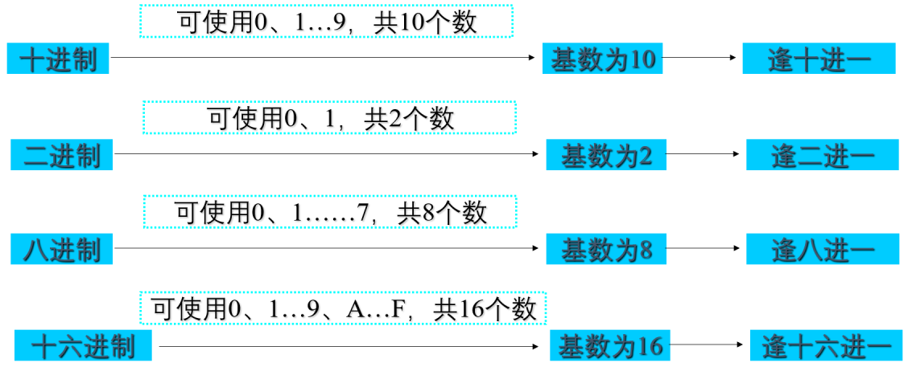

位权：是以基数为底、数字所在位置的序号为指数的整数次幂。

问题的提出：一个数码处在不同位置所代表的值是不同的。例如十进制中，数字5在个位、十位、小数点后1位分别代表5、50和0.5，这是为什么呢？

> 回答：其奥妙就在于位权。因为在十进制中，个位、十位、小数点后1位的位权不同，分别为1、10和0.1。

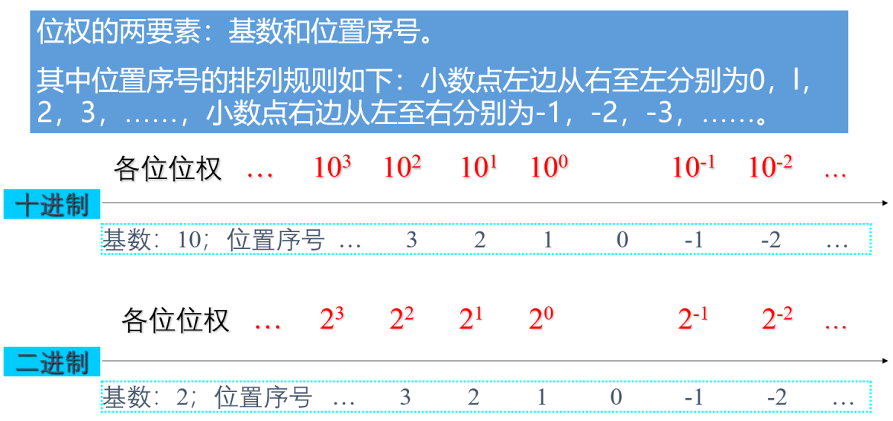

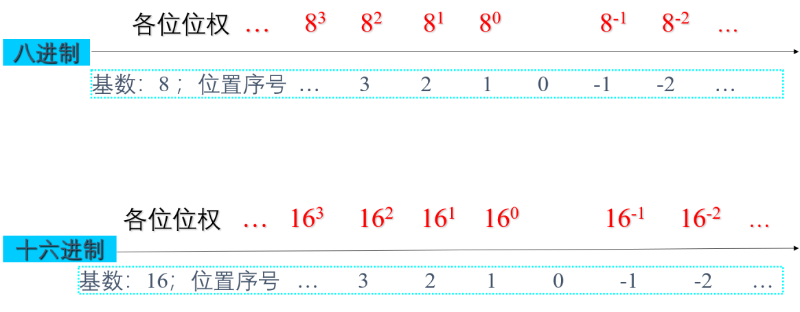

有了基数和位权，我们就可以将一个数按权展开了。

以十进制为例，十进制的个位数位置的位权是 $${10}^0$$，十位数位置的位权为$${10}^1$$，小数点后第1位的位权为$${10}^{-1}$$。

$${15369.58}_{10}=1*{10}^4+5*{10}^3+3*{10}^2+6*{10}^1+9*{10}^0+5*{10}^{-1}+8*{10}^{-2}$$

## 二进制

在现代电子计算机中，采用0和1表示的二进制来进行计数。为什么计算机中使用二进制进行计数，而不采用其他计数制呢?

* 二进制使用0和1进行计数，相应地对应两个基本状态。对于物理元器件而言，一般也都具有两个稳定状态，这些可以用0和1两个数码来表示。
* 二进制数的运算法则少，运算简单，使计算机运算器的硬件结构大大简化。
* 二进制的0和1可以对应逻辑中的真和假，可以很自然地进行逻辑运算。

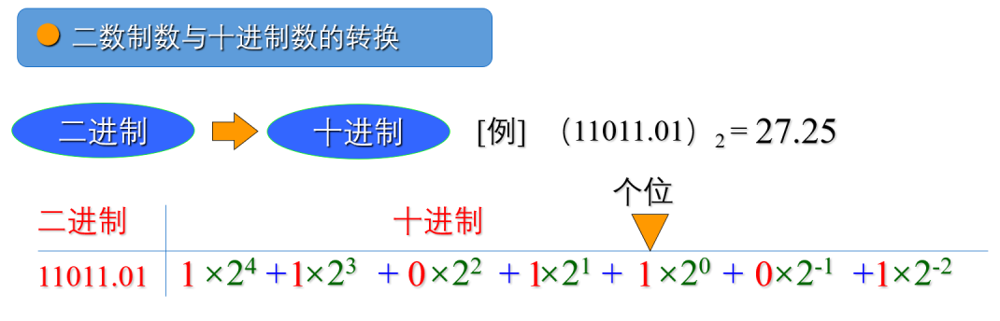

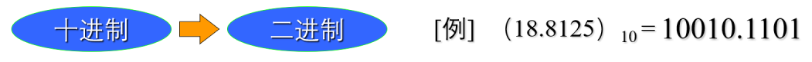

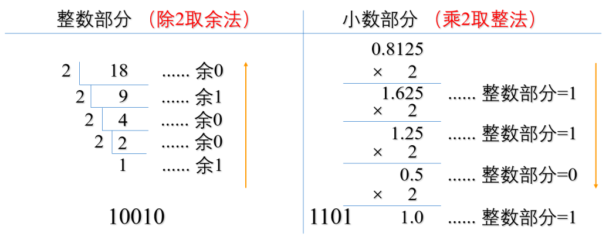

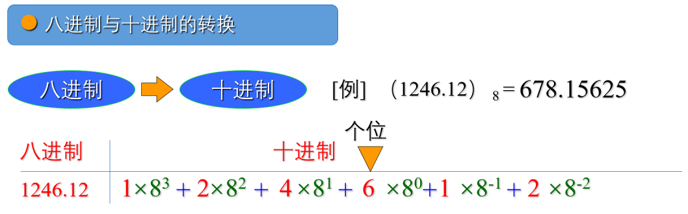

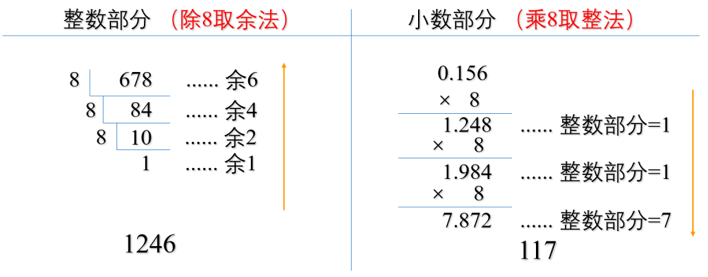

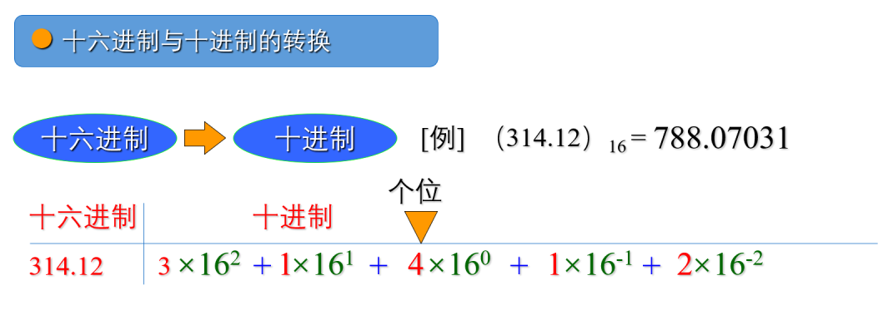

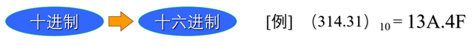

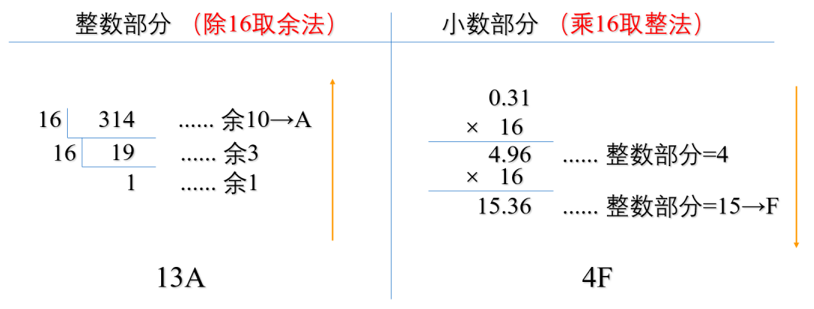

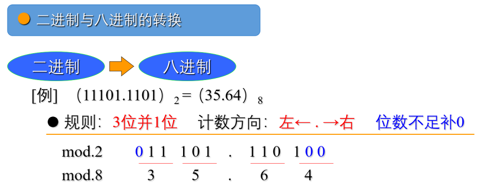

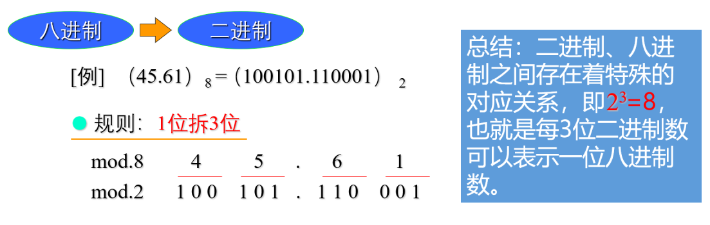

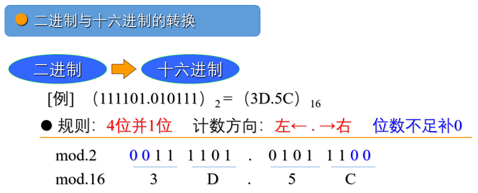

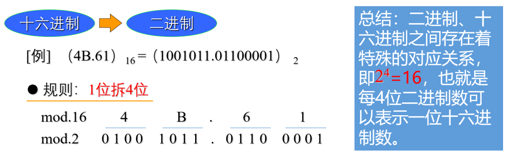

## 信息编码和基本运算

信息（包括图像、符号、图形和声音等）需要按照规定好的二进制形式表示才能被计算机处理，这些规定的形式就是信息编码。（其实就是把信息转化为0和1）

### BCD码

用二进制编码表示十进制数的方式,即每1位十进制数数字对应4位二进制编码,又称8421码。

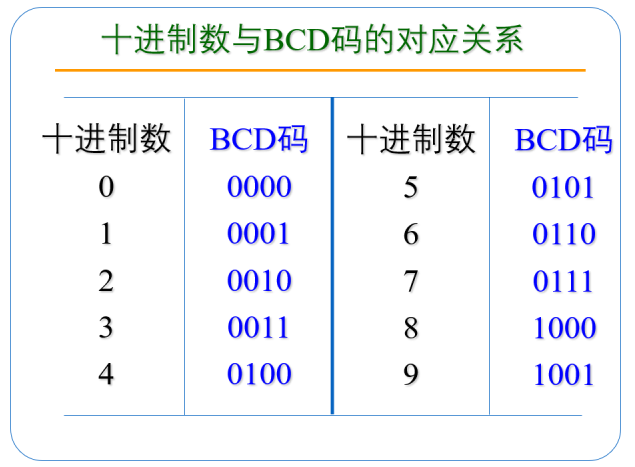

### ASCII码

在计算机中，各种字母和符号必须使用规定的二进制码表示，计算机才能处理。在西文领域，目前普遍采用的是ASCII码(American Standard Code for Information．Interchange，美国标准信息交换码)。将每个字符用 `7 位的二进制数`来表示，共有 `128` 种状态。

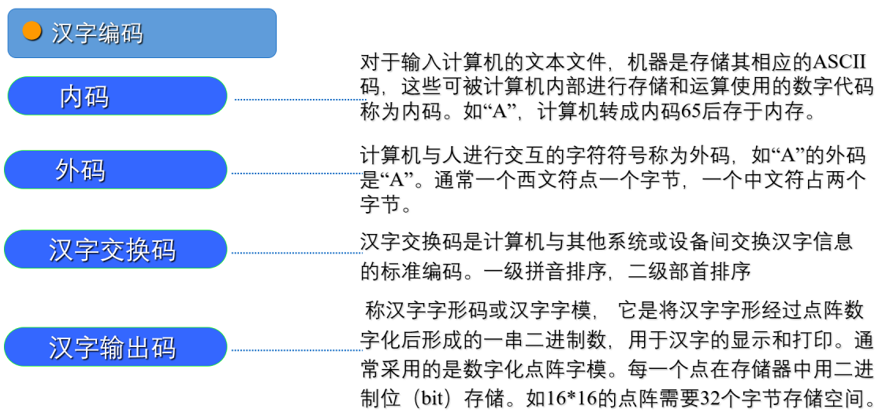

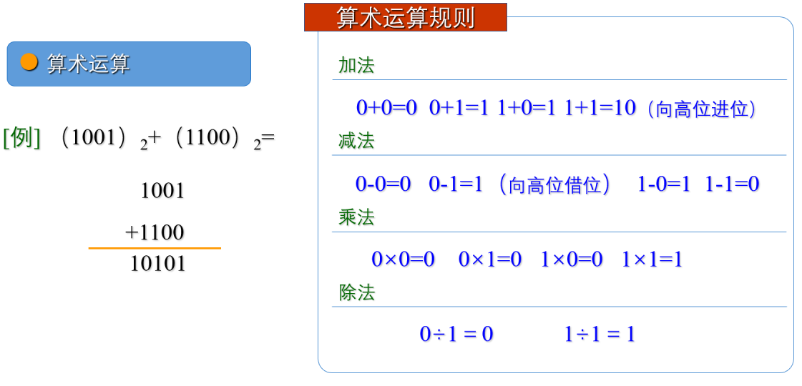

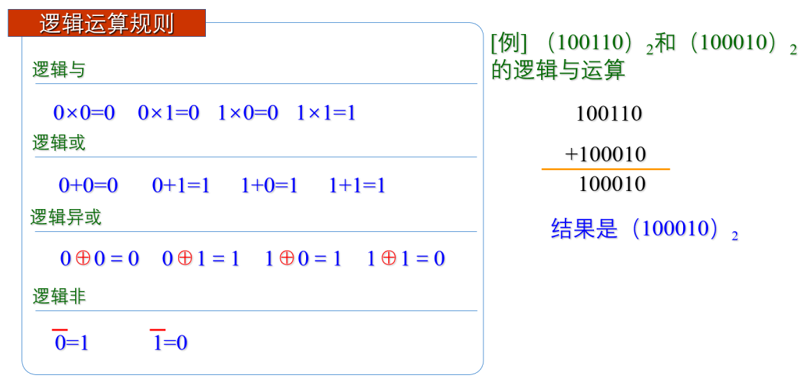

