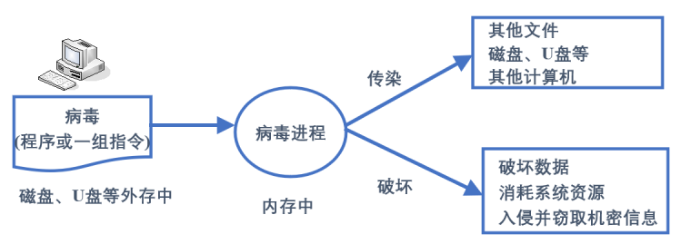
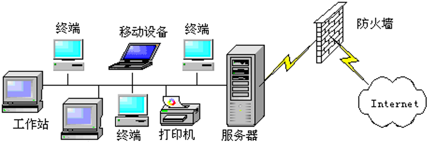

# 计算机病毒

## 计算机病毒概述

计算机病毒是隐藏在计算机系统中， 利用系统资源进行繁殖并生存， 能够影响计算机系统的正常运行，并可通过系统资源共享的途径进行传染的程序。 简单地说，计算机病毒是一种特殊的具有破坏作用的程序，是人为制造的，具有传染性，属于软件的范畴。当计算机运行时源病毒能把自身精确地拷贝或者有修改地拷贝到其他程序体内，影响正常程序的运行和破坏数据的正确性。

## 计算机病毒的特征

1．传染性：是计算机病毒的主要特征，计算机病毒具有很强的再生能力，它可以将自身的复制品或变种通过内存、磁盘、网络等传染给其他的文件、系统的某个部位或其他计算机。

2．破坏性：计算机病毒的目的在于破坏计算机系统，表现在修改和删除大量的文件和数据，占用系统资源使系统运行速度下降，使系统无法运行甚至瘫痪。

3．隐蔽性：是指计算机病毒进入系统后不易被发现，具有传染的隐蔽性和存在的隐蔽性。

4．潜伏性：病毒具有依附其他媒体而寄生的能力，它入侵系统后不立即发作，可以潜伏几周、几个月甚至更长时间而不被发现。

5．激发性：是指计算机病毒是有控制条件的，当外界条件满足计算机病毒发作条件时，计算机病毒开始传染或破坏数据。

## 计算机病毒的分类

病毒的种类很多，分类方法也不同。

1. 文件型病毒：这类病毒攻击的对象是文件，并寄生在文件上 ( 主要感染各类可执行文件 ) 。当文件被装载时，病毒程序运行。
2. 引导型病毒：主要传染磁盘上的系统引导区，它是把病毒程序加入或替代部分操作系统进行工作的病毒。系统一启动时病毒就被激活。
3. 网络病毒：上面1，2两种病毒是传统的，网络发展后出现了网络病毒，它占用网络带宽，造成网络拥塞甚至网络系统瘫痪。这种病毒通过网页浏览、邮件收发、文件下载传播，传播速度快，清除难度大。

## 计算机病毒的来源

**病毒的防范**：计算机病毒的传播途径主要有两个：网络和U盘，要防止病毒的侵害，就要以预防为主， 堵塞病毒的传播途径。

常用的防范策略：

（1）安装杀毒软件

（2）安装个人防火墙：监控进出内部网络或计算机的信息l过滤不安全的服务l限制内部网络用户访问某些特殊站点l对网络访问进行记录和统计

（3）个人密码设置尽可能复杂

**病毒的检测和消除**：为防止计算机病毒的侵害， 一方面预防， 一方面还要经常检测和消除病毒。检测和消除病毒的方法有两种，一是人工检测和消除，一是软件检测和消除。

(1) 人工检测和消除：由计算机专业人员进行，可通过找出有病毒的内容将其删除或用正确内容将其覆盖来消除病毒。该方法难度大，技术复杂。

(2) 软件检测和消除：使用杀毒软件 ( 如瑞星， 360等) 进行检测和消除。该方法操作简单、使用方便，适用于一般计算机用户。

除以上两种方法外， 还可通过对磁盘进行格式化来消除病毒。 由于采用此方法时磁盘上的信息也同时被消除， 故应慎重使用。
