# 计算机网络

## 网络的定义

计算机网络就是利用通信线程和设备，把分布在不同地理位置上的多台计算机连接起来，在功能完善的网络软件（网络协议、网络操作系统等）的支持下，实现计算机之间数据通信和资源共享的系统。

计算机网络是计算机技术与通信技术相结合的产物。

网络中计算机与计算机之间的通信依靠协议进行。协议是计算机收、发数据的规划。主要包括IP和TCP协议。

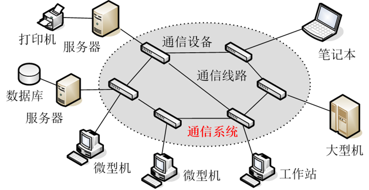

## 网络的发展

### **面向终端的第一代计算机网络**

以单个主机为中心的远程联机系统，实现了地理位置分散的大量终端与主机之间的连接和通信，各终端通过通信线路共享昂贵的中心主机的硬件和软件资源。

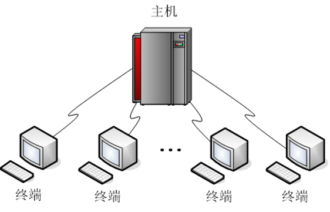

### 以分组交换网为中心的第二代计算机网络

以分组交换网络为中心，主机都处在网络的外围。用户通过分组交换网可共享连接在网络上的许多硬件和各种丰富的软件资源。

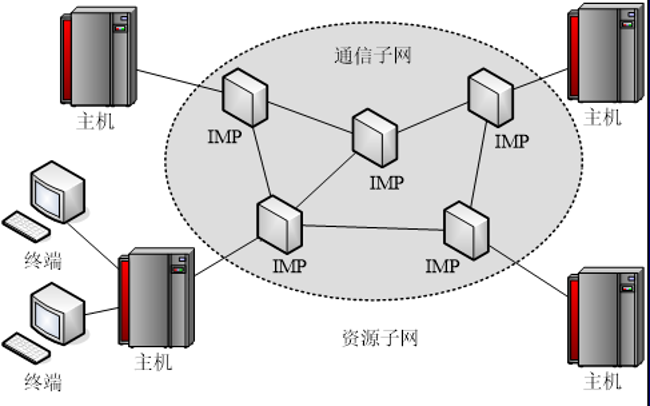

### 以网络互联为核心的第三代计算机网络

通常将网络之间的连接称为“网络互连”，最常见的网络互连的方式就是通过“路由器”等互联设备将不同的网络连接到一起形成可以互相访问的“互联网”。著名的Internet就是目前世界上最大的一个国际互联网。

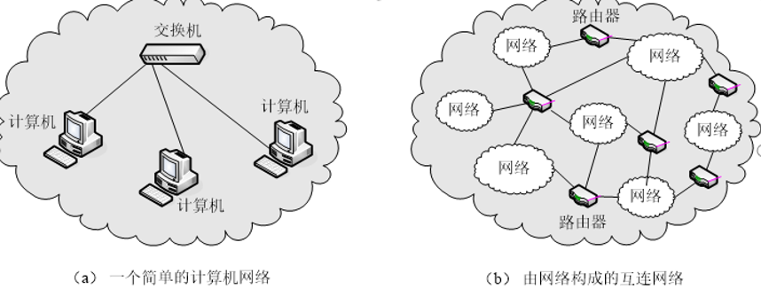

## 网络的主要功能

(1) 通信功能；

(2) 资源共享；

(3) 提高系统性能 ( 主要是可靠性和可用性 ) ；

(4) 实现数据的传输和集中管理；

(5) 匀衡负载 ( 即分布式控制和分担负荷 ) ，提高计算机的处理能力。

## 网络的分类

按网络的地理范围进行分类：局域网（LAN）、城域网（MAN）和广域网（WAN）。

**局域网(Local Area Network)**

局域网是指地理范围在几米到十几公里内的计算机及外围设备通过高速通信线路相连的专用网络。现在局域网已非常广泛地使用，一个学校或企业大多拥有许多个互连的局域网，这样的网络常称为校园网或企业网。

局域网的特点：

传输距离有限：一般在几米到十几公里范围。

传输速率高：一般在10Mbps～10Gbps。

传输可靠性高：误码率通常在10-7～10-12（误码率指每传送n个位，可能发生一个位的传输差错）。

结构简单，协议简单，容易实现，具有较好的灵活性。

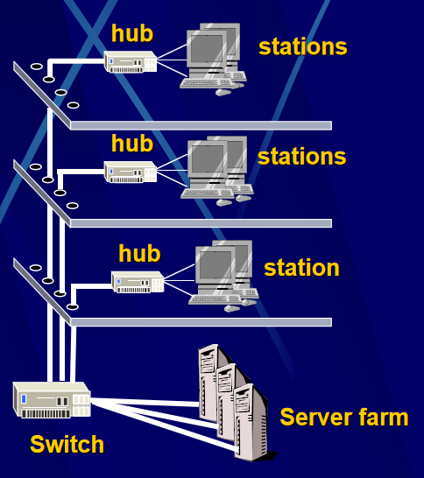

**城域网(Metropolitan Area Network)**

城域网是在一个城市范围内建立的计算机通信网。城域网通常使用与局域网相似的技术，传输媒体主要采用光缆。

实际上城域网技术并没能在世界各国迅速地推广，而在实际中被广域网技术所取代。

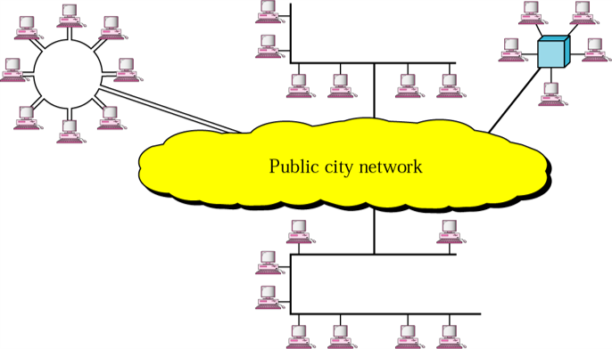

**广域网(Wide Area Network)**

广域网一般是在不同城市和不同国家之间的LAN或者MAN网络互联，地理范围通常为几十公里到几千公里，它的通信传输装置和媒体一般由电信部门提供。

广域网的特点：

覆盖范围大：通信距离通常为几十公里到几千公里。

传输速率低，传输误码率也较高。这主要由于广域网常常借用传统的公共传输网（如电话网）进行通信，但随着新的光纤标准和能够提供更快传输率的全球光纤通信网络的引入，广域网的速度和可靠性也将大大提高。

通信子网通常由电信部门负责建设，或借用现成的公共通信网络，不像局域网那样需要用户自己建设p结构复杂，协议复杂，投资大，实现周期长。

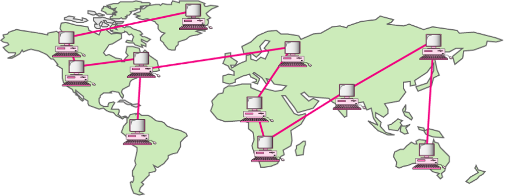

## 网络拓扑结构

计算机网络的物理拓扑结构是描述计算机网络中通信子网的终点与通信线路间的几何关系。它对网络的性能、网络协议的实现、网络的可靠性以及网络通讯成本都有重要影响。

主要分为以下几种结构：

星形 总线形 环形 树形 网状形

**星形**：存在一个中心节点，每个节点通过点到点的链路与中心节点连接，所有通信都通过中心节点进行。交换局域网是一种典型的星型拓扑结构。

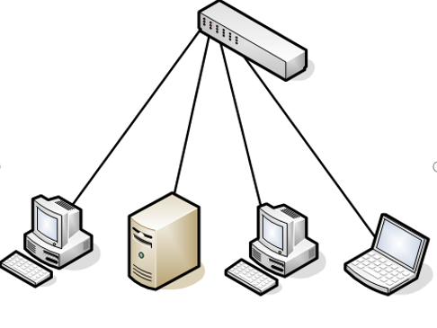

特点与应用：

**优点**

* 结构简单、组网容易、控制相对简单；
* 故障影响小且容易检测和排除。

**缺点**

* 电缆数量大，安装工作量可观；
* 通信线路利用率低；
* 中心节点是全网可靠性的瓶颈，如果中心节点出现故障，则整个网络的通信就会瘫痪。

在以太网中得到了非常广泛的应用。

**总线形**：所有节点都连接到一条作为公共传输媒体的总线上，信息的传输以广播方式进行。

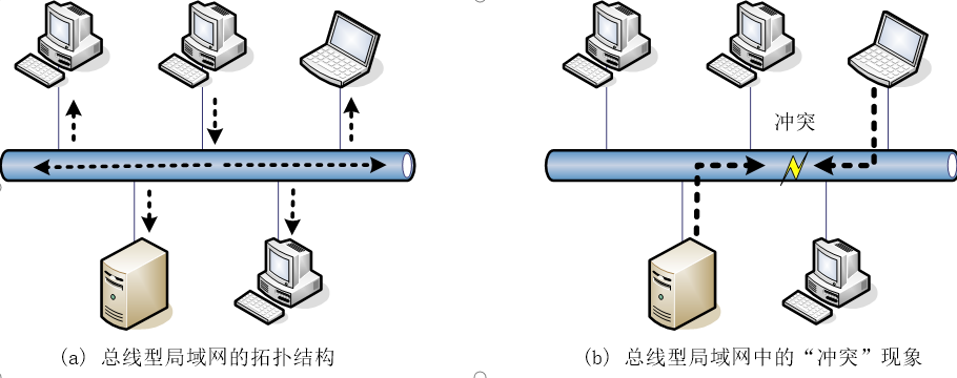

特点与应用：

优点

* 布线简单、节点增删容易、成本较低。

**缺点**

* 节点发送信息时要竞用总线，容易引起冲突；
* 如果节点数过多，则会降低网络的速度；
* 故障影响大且难以检测和排除。

早期用于以太网，目前已经较少采用。

**环形**：以共享媒体方式进行数据传输。每个节点都与两个相邻节点相连，节点之间采用点到点链路，网络中所有节点构成一个闭合的环。环中数据沿着一个方向绕环逐站传输。

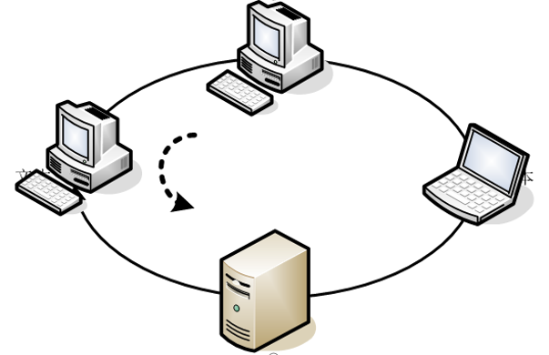

特点与应用：

**优点**

* 结构简单、实时性强。

**缺点**

* 增删节点操作复杂且会干扰整个网络的正常运行；
* 故障影响大且难以检测和排除。

早期的令牌环网和FDDI就是采用环型结构，目前环型拓扑由于其独特的优势（单向传输）主要应用于光纤网中。

**树形**：树型拓扑可以看作是星形拓扑的扩展。

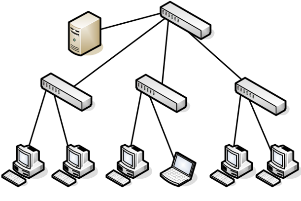

特点与应用：

**优点**

* 星型拓扑结构的优点；
* 可扩展性好 。

**缺点**

* 星型拓扑结构的缺点；
* 各个节点对根节点的依赖性太大。

在以太网中得到了非常广泛的应用。

**网状形**：节点之间的连接是任意的，没有规律 。有一种特殊的网状就是全连接，任何两个节点间都有连接。

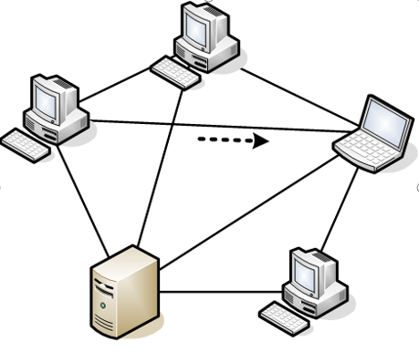

特点与应用：

**优点**

* 系统可靠性高，即：系统不受瓶颈问题和失效问题的影响。

**缺点**

* 结构复杂、成本高、网络协议复杂。

军方或其它特殊用途，一般应用不使用这种结构。

## 网络协议

网络协议（network protocol），简称为协议，是为进行网络中的数据交换而建立的规则、标准或约定的集合。协议主要由三个要素组成：

语法：通信时双方交换数据和控制信息的格式。

语义：每部分控制信息和数据所代表的含义。

同步：事件实现顺序的详细说明。例如：通信如何发起；在收到一个数据后，下一步要做什么。

### 类比:人类协议和网络协议

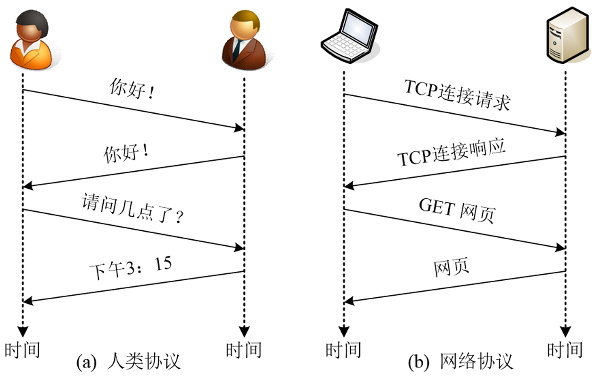

### 协议设计

设计网络协议是一个十分复杂的系统，而工程设计中对复杂的系统常采用结构化设计方法（划分层次），网络协议的设计也可以借鉴。

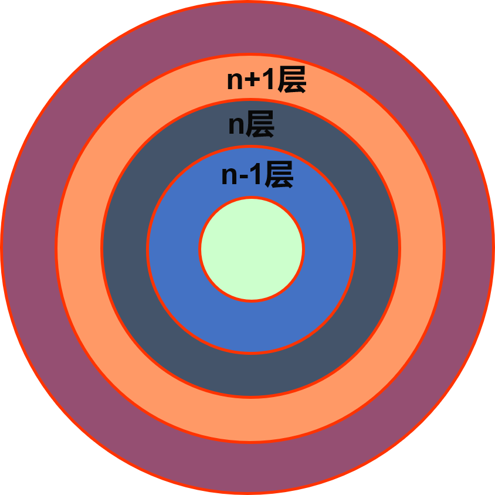

**协议分层设计**

概念上可以认为通信是水平的，但是事实上`水平通信要依赖垂直通信来实现`。

网络协议被分解成若干相互有联系的简单协议，这些简单协议的集合称为协议栈。

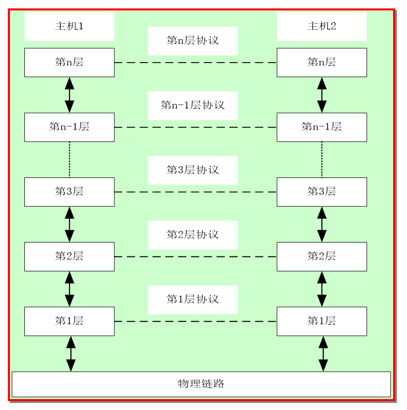

### 类比:信件的寄送过程

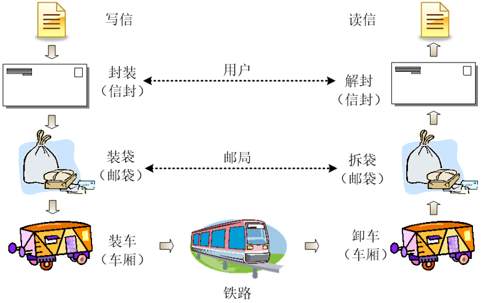

### 分层设计后的数据传输

发送端：封装；接收端：解封。

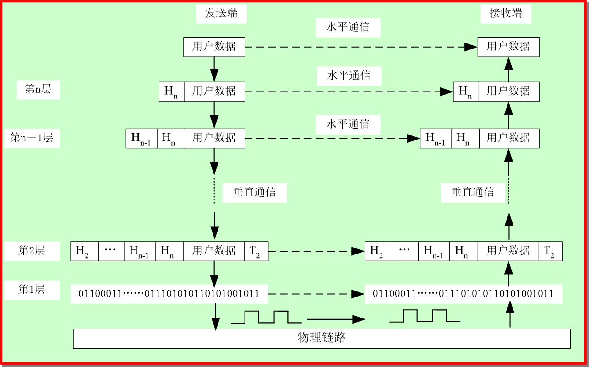

## 网络体系结构

网络体系结构（architecture）是计算机网络的各层及其协议的集合，即：这个计算机网络及其部件所应完成的功能的精确定义。

#### ISO/OSI参考模型

OSI参考模型（开放系统互联参考模型）由ISO组织提出，目的是实现异种机互连。“开放”表示任何两个遵守OSI标准的系统可以互连。“系统”指计算机、终端或外部设备等。

OSI参考模型相关的协议已经很少使用，但是该模型本身是非常通用的，并且仍然有效，在每一层上讨论到的特性也仍然非常重要。

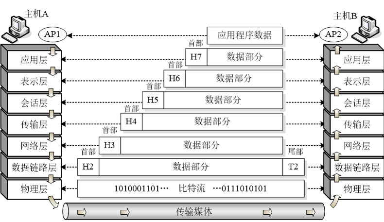

水平双向虚箭头线表示概念上的通信（虚通信）&#x20;

空心箭头表示实际通信（实通信）

#### TCP/IP体系结构

TCP/IP体系结构是Internet所使用的体系结构，目的是用于网络互连，是事实上的工业标准（从这个意义上说，ISO/OSI参考模型可以说是法律上的国际标准）。

TCP/IP体系结构的模型本身并不非常有用，但是协议却被广泛使用开了，TCP和IP协议是其中最重要的两个协议。

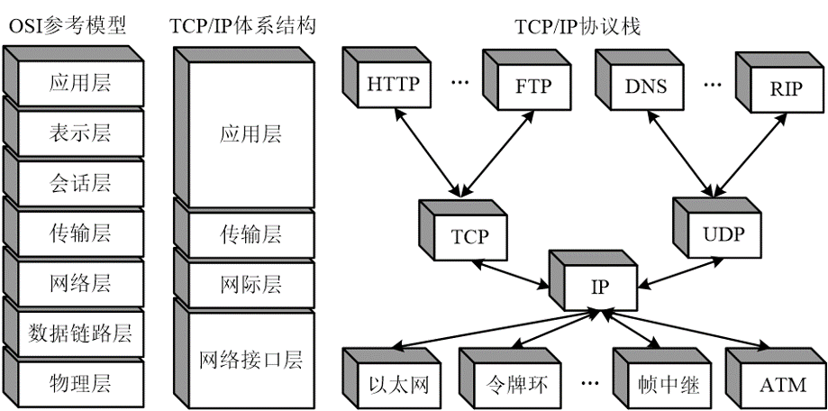

## IP地址

IP地址是给互联网上的每一台主机（或路由器）的每一个接口分配一个在全世界范围内唯一的32位的标识符。IP地址通常被分割为4个“8位二进制数”（也就是4个字节）。IP地址通常用“点分十进制”表示成（a.b.c.d）的形式，其中，a,b,c,d都是0\~255之间的十进制整数。例：点分十进IP地址（100.4.5.6）

IP地址将IP地址空间划分为A、B、C、D、E五类（其中A、B、C是基本类，D、E类作为多播和保留使用），都是由网络ID和主机ID两部分组成。同一个物理网络上的所有主机都使用同一个网络ID，网络上的一个主机（包括网络上工作站，服务器和路由器等）有一个主机ID与其对应。

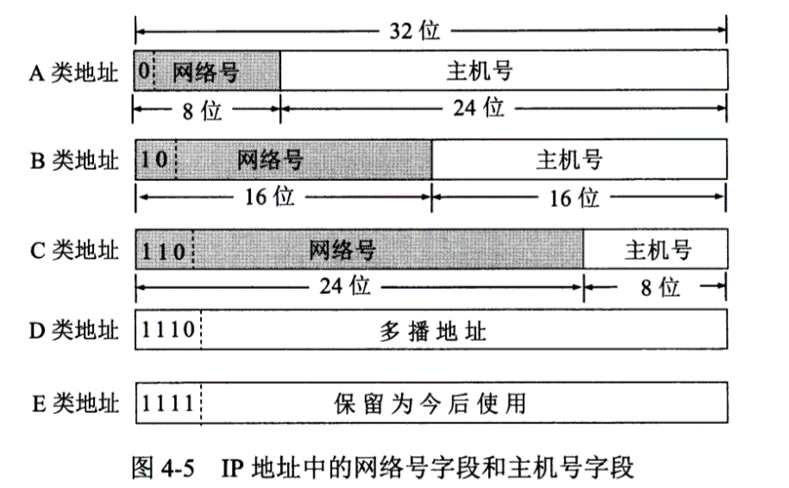

每类地址最前面的几位为类别为，A,B,C类地址的类别位分别为0,10,110&#x20;

D类地址用于多播&#x20;

E类地址保留为今后使用

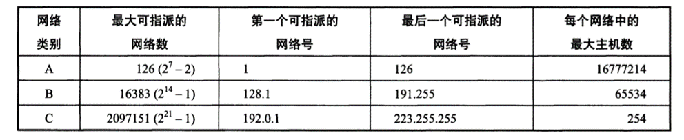

## Internet概述

Internet 是一个通过网络互联设备 —— 路由器，将分布在世界各地的数以万计的局域网、 城域网以及大规模的广域网连接起来， 而形成的世界范围的最大计算机网络，又称全球性信息资源网。这些网络通过普通电话线、高速率专用线路、卫星、微波、光纤等将不同国家的大学、 公司、科研部门、政府组织等的网络连接起来，为世界各地的用户提供信息交流、通信和资源共享等服务。

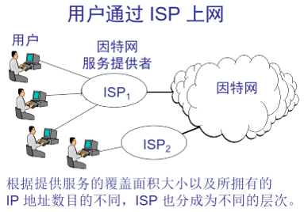

因特网起源于20世纪60年代中期，由美国国防部高级研究计划局（ARPA）自主的ARPANET，此后提出的TCP/IP协议为因特网的发展奠定了基础。

Internet 网络互连采用 TCP/IP协议。

TCP：传输控制协议（Transmission Control Protocol）

IP：网际协议（Internet Protocol）

用户进入互联网，需要借助互联网服务（ISP）提供商的服务。

## Internet的结构与组成

从 Internet 实现技术角度看，它主要是由通信线路、路由器、 主机、信息资源等几个主要部分构成。

&#x20;(1) 通信线路： 用来将 Internet 中的路由器与路由器、 路由器与主机连接起来。 通信线路分为有线通信线路与无线通信信道， 常用的传输介质主要有双绞线、同轴电缆、光纤电缆、 无线与卫星通信信道。 传输速率是指线路每秒钟可以传输数据的比特数。 通信信道的带宽越宽， 传输速率也就越高， 人们把 “高数据传输速率的网络 ”称为 “宽带网 ”。

&#x20;(2) 路由器：它的作用是将 Internet 中的各个局域网、城域网、广域网以及主机互连起来。

&#x20;(3) 主机：是信息资源与服务的载体。主机可以分为服务器和客户机。

&#x20;(4) 信息资源：包括文本、图像、语音与视频等多种类型的信息资源。

## 网址和域名

网址（IP地址）由32位（4字节）二进制数组成， 常将每个字节作为一段，每段由“.”隔开，例：202.96.209.5就是一个合法地址。IP地址由网络标识和主机标识两部分组成。

由于记忆毫无特征的IP地址非常困难，因特网引进了字符形式的IP地址，即域名。

其格式为：开头.主机名.主机类别.国家名（可以不要）。如：www.baidu.com域名一般有3\~5个字段，中间用“.”隔开。

因特网上的域名由域名系统（Domina Name System,DNS）统一管理。 DNS是一个分布式数据库系统，由域名空间、域名服务器、地址转换请求程序组成。

在因特网上域名和IP地址一样都是唯一的。

**顶级域名分三类**

&#x20;1.国家顶级域名，中国（cn），美国（us），英国（uk）；

&#x20;2.国际顶级域名——int，国际组织可在int下注册；

&#x20;3.通用顶级域名，如com、net、edu、gov、...

对于TCP/IP来说，域名必须被映射为IP地址才能使用。因特网中，专门用来管理域名和IP地址之间的映射关系的计算机叫域名服务器（Domina Name Server,DNS ）。

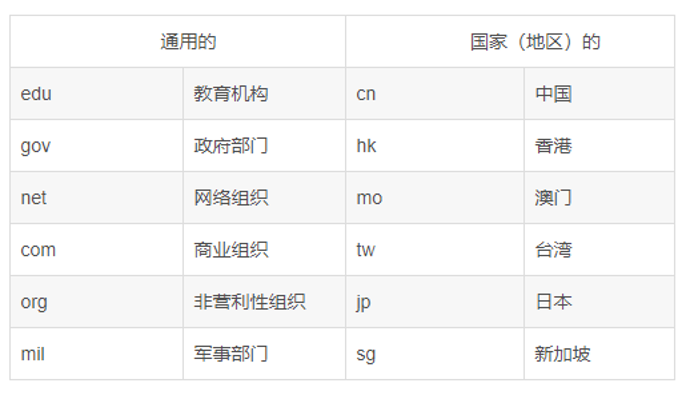

## 因特网提供的服务

有电子邮件，远程登录，文件传输，信息服务等。

万维网（WWW）**：**全球信息网，（World Wide Web），是全球规模的信息服务系统。是瑞士日内瓦欧洲粒子实验室最先开发的。如：www.baidu.com

电子邮件（E-mail）:格式为：收件人邮箱名@邮箱所在主机的域名

文件传输协议（FTP）:File Transfer Protocol：用于在计算机间传输文件，如：下载软件等。几乎所有类型的文件都可以。

远程登录（Telnet）:指通过Internet和其他主机连接。Telnet是远程登录服务的一个协议，定义了远程登录用户与服务器交互的方式。

WWW与HTML:WWW的网页文件是用超文本标记语言HTML编写的，并在超文本传输协议HTTP支持下运行的。超文本中不仅含有文本信息，还有声音，图像，图形，视频等多媒体信息，故又称超媒体。更重要的是，超文本中隐含着指向其他超文本的链接，这种链接成为超链。

URL:简单地讲，URL（统一资源定位器）就是因特网上的资源地址，每个Web界面，包括主页，都有唯一一个地址，格式为：协议名 // IP地址或域名，如：https://www.blackcat1995.com/

浏览器：WWW浏览器是一个客户端的程序，主要功能是使用户获取因特网上的各种资源。常用的浏览器有Microsoft，Internet Explorer（IE）。

## 电子邮件的相关概念

电子邮件概述：是因特网上使用最广泛的一种服务。

**电子邮件使用的协议：**

简单邮件传输协议：`SMTP（Simple Message Transfer Protocol）`

电子邮件扩展协议：MIME（Multipurpose Internet Mail Extensions）

接收邮件协议：`POP（Post Office Protocol）,又称POP3协议。`

邮件访问协议：IMAP（Internet Mail Access Protocol）
