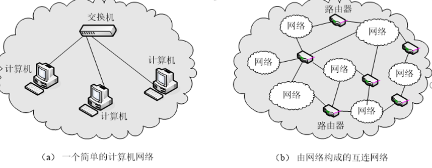

# 计算机网络

## 网络的定义

计算机网络就是利用通信线程和设备，把分布在不同地理位置上的多台计算机连接起来，在功能完善的网络软件（网络协议、网络操作系统等）的支持下，实现计算机之间数据通信和资源共享的系统。

计算机网络是计算机技术与通信技术相结合的产物。

网络中计算机与计算机之间的通信依靠协议进行。协议是计算机收、发数据的规划。主要包括IP和TCP协议。

## 网络的发展

### **面向终端的第一代计算机网络**

以单个主机为中心的远程联机系统，实现了地理位置分散的大量终端与主机之间的连接和通信，各终端通过通信线路共享昂贵的中心主机的硬件和软件资源。

### 以分组交换网为中心的第二代计算机网络

以分组交换网络为中心，主机都处在网络的外围。用户通过分组交换网可共享连接在网络上的许多硬件和各种丰富的软件资源。

### 以网络互联为核心的第三代计算机网络

通常将网络之间的连接称为“网络互连”，最常见的网络互连的方式就是通过“路由器”等互联设备将不同的网络连接到一起形成可以互相访问的“互联网”。著名的Internet就是目前世界上最大的一个国际互联网。

